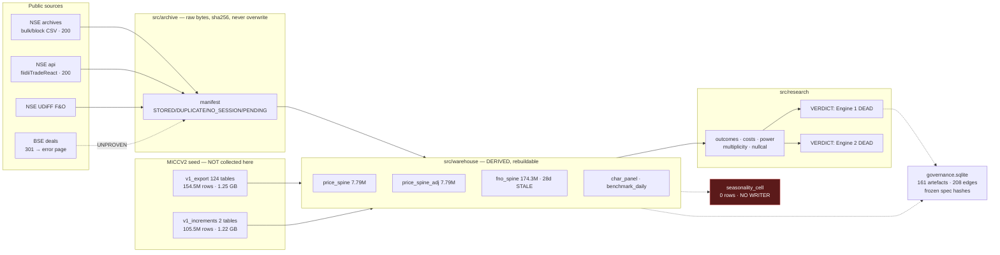

# AUDIT.md — senior quant-systems audit

**Audit date:** 2026-09-12 · **Commit:** `45fe5b0` · **Branch:** `claude/entity-verdict-study-vqsqh6` (= `origin/main`)
**Method:** every config read, `src/` and `tests/` enumerated and read in part, the suite executed, entrypoints executed, git history walked. Every claim below cites a path.

> **Environment caveat, stated once and load-bearing.** This audit ran in an **ephemeral Linux container** where `data/` holds **0 files** and `db/` does not exist (`find / -xdev -name "*.duckdb"` → nothing). So no live database was queried by me. Where I report row counts they come from **`docs/DATA_INVENTORY.md`**, which is machine-generated by `src/monitor/inventory.py` and was last run **2026-09-11 08:16 UTC on the owner's Mac**. I mark those as *(inventory)*. Anything I could execute here — the suite, imports, greps, entrypoints — I executed.
>
> A prior external audit exists: **`AUDIT_README.md`** (2026-09-02, 106 KB, commit `f79ac5d`). It is now 10 commits stale. This document is independent of it.

---

# 0. Executive snapshot

**This repository is not the product described in the brief.** It is a **rigorously-built research-governance harness wrapped around one narrow question** — *do disclosed institutional bulk/block deals in NSE cash equities predict returns?* — which it answered **no**, twice, in writing. The intended "India-market intelligence system" (NSE+BSE, all listed names, seasonality engine, smart-money tracker, eventual product) exists as **specification and scaffolding**; the delivered substance is a data lake inherited from a predecessor project plus an unusually disciplined experiment framework that has now returned two negative verdicts and shut its own research phase down.

The most important fact in the repo: **of ~260 M warehouse rows, this project collected 44,777 of them** *(inventory, group 3)*. Everything else is carried from **MICCV2**, a frozen predecessor. This is honestly labelled in-repo ("carried from MICCV2 under 0027"), but it reframes what was built: **the collector is ~3 weeks old; the data is inherited.**

**Stack** — Python ≥3.14 (`pyproject.toml:5`), DuckDB 1.5.5 + parquet (analytics), SQLite (governance ledger), pandas/numpy/scipy, PyYAML. **Scheduler:** macOS `launchd` (`scripts/com.institutional-research.collect.plist`). **UI:** none — `grep -riE "streamlit|fastapi|flask|dash|uvicorn"` over `src/ tests/ pyproject.toml scripts/` returns **zero framework hits**. No notebooks (`find . -name "*.ipynb"` → none). No `Makefile`, no `requirements.txt`, no `.env.example`, no `console_scripts`.

**Can I run it on a Mac tonight?** **Partially — yes for the code, no for the data.** The repo has no data; `data/` and `db/` are gitignored (`.gitignore:1-11`) and the seed is a 1.25 GB MICCV2 export that is **not in git and not fetchable** (`src/common/paths.py:60-70`: *"Irreplaceable — NSE does not serve this history"*). You can install and run the unit tier tonight; you cannot rebuild the warehouse without that export.

```bash
python3.14 -m venv .venv && .venv/bin/pip install -e ".[dev]"
RESEARCH_ENV=dev .venv/bin/python -m pytest -m unit -q     # 372 pass, 17 fail on Linux
```

**Overall maturity:** **usable research tool, single-question scope.** Far past prototype on governance, testing and honesty discipline (589 tests, 58 decision records, content-addressed provenance DAG, pre-registration with frozen spec hashes). Far short of product on breadth (NSE-only, cash-only), surface (no UI/API), and durability.

**Biggest risk — a backup that lags the data it protects.** Backups exist and work: **29 generations, newest 2026-09-10 17:04 UTC**, off-machine, with a restore drill built in (`scripts/backup.sh:28-30`), wired as the last stage of the daily job (`scripts/collect_daily.sh:167`). But the project's own monitor grades it **AT RISK**: *"3 commit(s) and 73 archived session(s) not in it"* (`docs/HEALTH.md:36`), and those sessions **cannot be re-fetched at any price** — the historical endpoint answers 503. The structural cause is ordering: backup runs **last**, so any earlier stage failing means the day is collected and never backed up. Move it to the front (§10).

---

# 1. Repository map

```
MICC_V3/
├── AUDIT_README.md          106 KB prior external audit (2026-09-02, commit f79ac5d — stale)
├── README.md                6.4 KB — STALE (claims 540 tests / 51 decisions; actual 589 / 58)
├── pyproject.toml           requires-python >=3.14; 6 runtime pins; no console_scripts
├── configs/                 10 YAML files, 2,088 lines — the design lives here
├── migrations/              6 forward-only checksummed SQL files (2 sqlite, 4 duckdb)
├── src/                     13,606 lines, 9 packages
│   ├── archive/   fetch + hash + store raw bytes (prices, corp actions, insider, derivatives, stopgap)
│   ├── ingest/    parse + land archived bytes (bhavcopy, corp_actions, insider, land, parse, publication)
│   ├── identity/  security master, symbol history
│   ├── warehouse/ spine builders (price, adjusted, F&O), benchmarks, seed, reconcile, participant_oi
│   ├── mart/      clean deal mart, eligibility
│   ├── research/  20 modules — power, multiplicity, costs, outcomes, verdicts
│   ├── governance/ provenance DAG, ledger preconditions
│   ├── monitor/   status, health, inventory, backup_state
│   └── common/    paths, calendar, hashing, migrate
├── tests/          7,562 lines, 34 test files, 589 tests collected
├── scripts/        collect_daily.sh, backup.sh, launchd plist, 3 registration scripts, build_report.py
├── docs/           72 markdown files — 58 decisions, 4 plans, STATUS/HEALTH/DATA_INVENTORY (generated), 4 reports
├── data/           EMPTY in this container (0 files). Gitignored.
└── db/             ABSENT in this container. Gitignored.
```

**Entrypoints.** No CLI framework. 34 modules are `python -m` runnable (`grep -rln "__main__" src/`). The real entrypoint is the shell orchestrator `scripts/collect_daily.sh`, which runs 14 stages in dependency order and is driven by `launchd` at 20:00 and 22:30 IST weekdays plus a catch-up slot (`scripts/com.institutional-research.collect.plist`).

**Install/run.** `pip install -e ".[dev]"`. Note: `pyproject.toml` declares `requires-python = ">=3.14"` while CI pins `python-version: "3.12"` (`.github/workflows/tests.yml`) — **CI does not test the declared interpreter**, and it only works because CI installs dependencies directly rather than installing the package.

**Secrets / API keys.** **None required** — and that is a genuine design strength. Every source is an unauthenticated public endpoint. `sources.yml:26-37` sets a browser `user_agent`, 2 s rate limit, 3 retries, 5 s backoff base, session warm-up for cookies, and `respect_robots: true`. `kite_connect` is listed only as *deferred* (`configs/sources.yml:183`). One optional local file, `$HOME/.micc_alert_env`, is sourced for alerting (`scripts/collect_daily.sh`).

**Raw data location.** Gitignored and **absent here**. `tests/test_foundations.py` contains `test_no_database_or_data_file_is_tracked_by_git`, which greps `git ls-files` rather than trusting `.gitignore` — because MICCV2 had a database tracked despite an equivalent rule (`.gitignore:2-6`). That test is a good instinct.



---

# 2. Layer 1 — Data plane audit

Full table: **`DATA_INVENTORY.csv`** (27 datasets — 4 DONE, 15 PARTIAL, 6 MISSING, 2 BROKEN). Condensed:

| Dataset | Status | Source | Range | Universe | Format | Adj/PIT | QC | Daily | Evidence |
|---|---|---|---|---|---|---|---|---|---|
| Security master | PARTIAL | seed + built | — | 3,421 | DuckDB | symbol_history 3,735 | reconcile tol 0 | yes | `src/identity/master.py` |
| **NSE cash OHLCV** | **DONE** | seed + NSE direct | 2005-01-03→2026-09-10 | 4,200 (1,497 dead) | parquet 7.79 M | raw | jump guard; exact reconcile | yes | `src/warehouse/spine.py:87` |
| **BSE cash OHLCV** | **MISSING** | none | — | 0 | — | — | — | no | no BSE price source in `sources.yml` |
| Corporate actions | PARTIAL | seed 40,528 + 41 new | 2005-01-18→2026-09-08 | — | parquet | SPLIT/BONUS factored; RIGHTS NULL | 13 unit tests | yes | `src/ingest/corp_actions.py` |
| Adjusted prices | PARTIAL | seed spliced w/ raw tail | 2005→2026-09-10 | 4,200 | parquet 7.79 M | **yes, boundary-verified** | 4 real-event golden (needs_data) | yes | `src/warehouse/spine.py:319` |
| Delivery volume | PARTIAL | seed 7.69 M | 2005→2026-07-08 | — | seed only | not in warehouse | none | no | *(inventory g1)* |
| Index history | PARTIAL | seed 88,804 | 1997→2026-07-08 | 46 (scan wants ~202) | benchmark_daily 20,309 | PIT membership | degradation order | yes | `configs/benchmarks.yml` |
| **India VIX** | **BROKEN** | none | — | 0 | — | — | — | no | `costs.py:248` consumes VIX; **no VIX table** |
| FII/DII cash | PARTIAL | NSE API CONFIRMED | 2026-06-17→08-14 | 2 | JSON+parquet | — | publication bracketed | yes | `src/archive/stopgap.py:93` |
| F&O participant OI | PARTIAL | seed 15,359 | 2014-01-01→2026-06-25 | 5 | DuckDB | — | 15-col schema test | yes | `src/warehouse/participant_oi.py` |
| **Bulk deals** | **DONE** | seed 223,450 + NSE | 2006-01-02→2026-07-08 | 239,480 clean | parquet | `available_from` | hash dedupe; exact reconcile | yes | `configs/sources.yml:52` |
| **Block deals** | **DONE** | seed 12,430 + NSE | 2006-01-16→2026-07-08 | ↑ | parquet | ↑ | exact reconcile | yes | `configs/sources.yml:70` |
| BSE deals | MISSING | 301→error | — | 0 | — | — | probed, recorded | no | `configs/sources.yml:89,104` |
| Short selling | PARTIAL | seed 38,028 | 2018→2026-07-07 | — | seed only | — | none | no | *(inventory g1)* |
| Shareholding | PARTIAL | seed ~7.2 M | — | — | seed only | not reconstructed | none | no | route UNPROVEN `sources.yml:147` |
| Fundamentals | PARTIAL | seed 71,436 PIT | 2002→2026-03-31 | — | seed only | labelled PIT | none | no | *(inventory g1)* |
| Macro | PARTIAL | seed 4 tables | 1919→2026-05-01 | — | seed only | — | none | no | *(inventory g1)* |
| **USDINR / currency** | **MISSING** | none | — | 0 | — | — | — | no | grep returns nothing |
| **Commodities** | **MISSING** | none | — | 0 | — | — | — | no | grep returns nothing |
| F&O bhavcopy | PARTIAL | seed+inc 174.3 M | 2005→2026-08-14 | — | fno_spine 2.06 GB | — | reconcile (0029 fix) | **collected, NOT parsed** | `spine.py:96`; commit `472dfa8` |
| Option greeks/PCR | PARTIAL | seed 6.7 M | 2005→2026-07-07 | — | seed only | — | none | no | *(inventory g1)* |
| MF portfolios | PARTIAL | NAV 36.9 M only | 2006→2026-07-07 | 14,212 | seed only | **no holdings** | none | no | `sources.yml:166` deferred |
| **Trading calendar** | **DONE** | observed, never generated | 2005→2026-09-10 | 5,339 | DuckDB | observed-only | 3 Saturdays kept | yes | `src/common/calendar.py:1-12` |
| Insider disclosures | PARTIAL | seed 283,281 + 1,249 | 2016→2026-07-07 | — | parquet | available_from | `insider_power.py` | yes | `src/ingest/insider.py` |
| **PIT sectors** | **BROKEN** | declared `sector_history` | — | **0 rows** | empty table | **declared, empty** | marked IMPOSSIBLE (0057) | no | `universe.yml sectors.source` vs *(inventory g6)* |
| **Seasonality cells** | **MISSING** | — | — | **0 rows, no writer** | empty table | — | — | no | `grep seasonality_cell src/` → only `status.py:651` |
| **Participant aliases** | **MISSING** | — | — | **0 rows** | empty table | — | — | no | `entity_names.py:3` says explicitly *not* step 3.6 |

### Layering, versioning, bias

**Raw / clean / research layering: DONE, and properly.** `sources.yml:39-50` mandates `store_original_bytes: true`, `never_overwrite: true`, `dedupe_on: sha256`, `retention: forever`, with layout `raw/archive/{report_type}/{exchange}/year=/month=/`. The comment records *why*: the predecessor's `data/raw/**` were **all zero bytes** — fetches went straight into the warehouse. Flow is `archive/` (bytes) → `ingest/` (parse+land) → `warehouse/` (spines) → `mart/` (clean) → `research/`.

**Versioned, not overwritten.** Artefacts are content-addressed and immutable; `migrations/0001_governance.sqlite.sql:44-49` has `artefact_no_update` and `artefact_no_delete` triggers ("*a changed artefact is a new hash, not an edit*"). `source_revisions` (3 rows) exists because NSE/BSE silently restate bulk-deal files (`src/governance/provenance.py:21`). Spines are addressed by `data_checksum` over column values, **not bytes**, because DuckDB's parquet writer is not byte-deterministic (`spine.py:551-556`) — a subtle, correct call.

**Survivorship: handled, measured, not assumed.** `configs/universe.yml:3-6` — 4,200 symbols of which **1,497 stopped trading** before 2026-08-01, bucketed by era. Delisted names are **kept in research** (`universe.yml delisting.include_in_research: true`, marked OWNER DECISION), classified into MERGER/ACQUISITION/SUSPENSION/UNKNOWN, with `merged_into_requires_link`. This is better than most commercial vendors.

**Symbol/ISIN mapping: PARTIAL.** `symbol_history` 3,735 rows, `isin_renames` 276 rows, migration `0003_symbol_history_allows_isin_change.duckdb.sql` exists. But `universe.yml:8-9` records **7,354 unmatched deal events** as *naming mismatches, not survivorship*, and calls fixing it "the highest-value work in the project." `participant_aliases` — the table that would fix it — is **0 rows**.

**Corporate-action engine: PARTIAL.** Real logic with correct direction (`corp_actions.py:1-16`: factor = B/A for splits, B/(A+B) for bonus, RIGHTS deliberately NULL because it needs a cum price, demerger surfaced for a human). 13 unit tests cover ratio parsing, preference-share traps, and warrant/convertible rights. **But the classic-event golden test is MISSING** — `grep -rniE "reliance|tcs|infy" tests/` finds only a train/test-split fixture and a fund name. The nearest thing is `tests/test_corp_actions.py:133`, which checks **4 real 2026 events** (TDPOWERSYS, CORDELIA, GOODLUCK, KIRLPNU) are flat in the adjusted series — good, but `needs_data`, so it never runs in CI, and it tests recent events only. **And the adjusted series is mostly inherited**: `ADJUSTED.seed_glob = "stock_data_adj/**/*.parquet"` — MICCV2 computed it; this repo splices a raw tail onto it and verifies the boundary (2,696/2,696 symbols equal on 2026-06-25) plus refuses to build if a price-affecting action falls after the boundary (`spine.py:336-352`). That guard is excellent. It does not make this repo's own adjustment engine proven.

**Reconciliation: DONE, and the best thing in the repo.** `src/warehouse/reconcile.py` gates Phase 1 against MICCV2 as an oracle with `tolerance: 0`. It found **two defects in its own expectations**: (a) figures resolved against a directory marked for deletion (0027), and (b) `expect_fno_rows: 174,616,363` was a **naive sum of two overlapping sources** sharing 343,595 rows across ten dates in July 2016 — true distinct count 174,272,768 (0029). `universe.yml` keeps both numbers, the wrong one labelled `_superseded`. The file says it: *"A gate that had been written to pass would have hidden both."*

**Rate-limit / NSE blocking: DONE.** `sources.yml:27-30` records that a bare `curl` with no UA is rejected in ~0.2 s and **looks exactly like DNS failure** — the predecessor misdiagnosed this for days. Retry with exponential backoff (`stopgap.py:100-104`), rate-limit sleep (`:271`).

**Failure mid-backfill: DONE, and carefully.** `src/archive/prices.py:171-191` defines a manifest state machine: `STORED`/`DUPLICATE`/`NO_SESSION` are never re-probed; **`PENDING` and `FAILED` are deliberately absent from that set so they are retried**. A 404 on a past date is recorded once as `NO_SESSION` (a holiday) and never asked again. Identical bytes short-circuit on sha256 (`:253`). This is the correct design and it is tested.

---

# 3. Layer 2 — Pattern / seasonality engine

**Status: MISSING as an implementation. Present as specification and as a power proof that it cannot work.**

- **Hypothesis catalog: PARTIAL.** `configs/scan.yml` (365 lines) and `configs/confounds.yml` (198 lines) specify families, bases, folds, and named mechanisms. `src/research/families.py` (268 lines) + `configs/trials.yml` implement a **trial counter** charging search cost per family. But **no hypothesis is executed** — `seasonality_cell` has **0 rows and no writer**: `grep -rn "seasonality_cell" src/` matches only `src/monitor/status.py:651-660`, which *reads* the count. Phase 7 grades 1/8.
- **Walk-forward / embargo / multiplicity: DONE as machinery, unused for seasonality.** `configs/split.yml` defines a mandatory time split (explore 2005-2015 / confirm 2016+) **and** an index split, with the honest note that the 202 indices overlap massively so an index holdout is "largely the same underlying stocks." `scan.yml:173-186` tabulates measured design capacity — anchored 2 y test/1 y step gives **16 folds but 8 independent tests**; CPCV N=16,k=2 gives 120 paths but 16 independent. Embargo and purge are both 21 sessions. `src/research/multiplicity.py` (363 lines) implements BY, BH, Storey q and **Romano-Wolf** with a bootstrap; `src/research/nullcal.py` (362 lines) calibrates the instrument against synthetic noise and measured a **1.8% false-positive rate against a nominal 5%**.
- **Costs, liquidity, regimes: DONE.** `src/research/costs.py` (342 lines) implements date-effective statutory fees (STT, exchange txn, SEBI, stamp, GST on brokerage alone — `costs.py:128-136`), sqrt market-impact, Corwin-Schultz spread, and a VIX regime multiplier. `universe.yml liquidity_tiers` sets participation caps by turnover.
- **Concrete patterns that actually exist:** `src/research/seasonality_power.py` (191 lines, **written during this audit engagement**) and `docs/reports/SEASONALITY_POWER.md`. That is a **feasibility proof, not a pattern**. Its finding: at the project's own measured cross-sectional ρ = 0.2350, the 4,200-name universe carries the information of **4.25 independent names**, and a monthly calendar cell has **20 observations** (one firing/year), so the MDE is **219 bps/month at m = 1 with zero multiplicity correction** versus published calendar effects of 50-300 bps. Detecting 100 bps needs **96 years** at m=1, 580 under the 31.9 M-cell scan; 21 years exist. **Verdict: DEAD, binding constraint sample size.**
- **Extensibility: PARTIAL.** Adding a hypothesis means adding YAML to `scan.yml`/`confounds.yml` and a trial family to `trials.yml` — no core rewrite. But since no executor exists, "adding a hypothesis" currently adds a declaration, not a test.
- **Leakage: no evidence of any, and strong controls.** `configs/research.yml:46` `no_same_day_close: true`; entry is next-session open; `src/ingest/publication.py` **brackets publication empirically** from three polls/day (`last poll returning a DIFFERENT session < publication <= first poll returning THIS session`) and assigns `confidence='LOW'` to the 2006-2026 history where no such record can ever be reconstructed. `src/research/measure.py:125-145` documents a real bug it fixed: `LEAD(close, N)` counts **traded rows, not sessions**, so a name that suspended and relisted supplied its 252nd row years later — 37 of 1,145 twelve-month events spanned >500 calendar days, worst ATLASCYCLE at **3,506 days (9.6 years)**. Those rows are now NULL rather than dropped, because "COUNT(*) and avg() disagreeing is how these events hide."
- **Outputs:** markdown memos (`docs/reports/`), generated `docs/STATUS.md` / `HEALTH.md` / `DATA_INVENTORY.md`, a PDF report (`docs/report/PROJECT_REPORT.pdf`), governance rows. **No plots, no scorecards, no tables served anywhere.**

---

# 4. Layer 3 — Institutional tracker

**Status: the most-built layer, and the one that produced the project's headline negative.**

- **Granularity: client-level, not just aggregate.** `institutional_deals_clean` holds **239,480 rows** with 28 columns *(inventory g6)*; `deal_forward_outcomes` 52,365 rows. Aggregate FII/DII is collected separately. So this is genuinely client-name-level bulk/block data, which is the interesting version.
- **Client canonicalization: PARTIAL, deliberately shallow.** `src/research/entity_names.py` is a **60-line** counting-grade normalizer whose docstring states it is **NOT** Plan 1 step 3.6, and `participant_aliases` (the reviewed alias table) holds **0 rows**. Measured effect of even the shallow version: **20,660 → 19,248 entities, 1,412 merged**; candidates at the ≥30-deal/≥12-month floor moved **119 → 133**; *HDFC Standard Life carried eight spellings, SBI Life six* (`docs/reports/ENTITY_VERDICT.md`). That fragmentation was hiding exactly the long-only institutions the study needed.
- **Economic-role classification: DONE and, in my view, the single best analytical idea here.** `src/research/roles.py` (98 lines) classifies on **names only, before any return is computed**, into LONG_ONLY / ARBITRAGE / ODI_ISSUER / INDEX_VEHICLE / BANK_EXECUTION / UNKNOWN, defaulting to UNKNOWN and never to LONG_ONLY. Measured distribution: UNKNOWN 78 (reported, not tested), BANK_EXECUTION 27 excluded, **LONG_ONLY 24 tested**, ARBITRAGE 2 excluded, ODI_ISSUER 2 excluded. The rationale is exactly right: *a cash bulk buy from an arbitrage desk is a delta hedge, not a view.*
- **Forward-return scorecards: DONE.** Nine horizons from `configs/research.yml` (`horizons_sessions: [1,2,3,5,10,21]` + `horizons_months: [3,6,12]`), excess vs **CHAR_MATCHED** (size × momentum × volatility, own name removed) with EW_TOP500 alongside, full cost stack. `src/research/outcomes.py` (494 lines) handles four exit cases; suspensions/delistings are priced rather than absorbed.
- **Quarterly holdings reconstruction: MISSING.** `shp_*` tables sit in the seed unreconstructed; the live route is UNPROVEN; `promoter_entities` and `deal_interpretation` are **0 rows**.
- **Smart-vs-noisy ranking: ATTEMPTED AND KILLED.** `docs/reports/ENTITY_VERDICT.md` — pre-registered (`spec_hash 8e7436d7aa9e9186`), tiered on formation-period data only, BH-FDR 5% across 24 declared tests. Result: **0 entities passed in the TOP tier**; tier means non-monotonic (TOP +1.11%, MID −1.46%, BOTTOM +0.13%); **12 of 24 entities had zero formation-period deals**, so the registered walk-forward *could not be run* — and was run as written anyway rather than moved to where the data is thick. **VERDICT: DEAD.**
- **What cannot be known, and whether the code pretends: it does not pretend, and this is its strongest suit.** A bulk deal is a **print, not a position** — ≥0.5% of equity crossing on one day, with no holding period, no cost basis, no sibling trades. `src/mart/eligibility.py` excludes PROP_HFT. `configs/scan.yml:63-73` records that pooling market-relative returns is **identically zero by construction** (max |cross-sectional mean| = 1.698e-17), so the pooled question *"is trading day 47 good on average?"* **has no content** — and the file marks it `FORBIDDEN_IDENTICALLY_ZERO` rather than reporting a weak result. `docs/decisions/0056` is titled *"the participant study cannot be run and the machine does not invent findings."* I looked for overclaiming and found the opposite.

---

# 5. Product surface

**Essentially none, by design — and that is consistent with the brief's "analytics first."**

- **Dashboard / API: MISSING.** Zero framework imports anywhere. `src/common/paths.py:127` notes the predecessor *"served 12 dashboard pages straight off the live DuckDB file"* — mentioned as an anti-pattern.
- **CLI: PARTIAL.** 34 `python -m` modules, no unified CLI, no `console_scripts`, no `--help` surface.
- **Reports: DONE.** `scripts/build_report.py` renders `docs/report/PROJECT_REPORT.md` → PDF with mermaid.
- **Alerts: PARTIAL.** `scripts/collect_daily.sh` sources `$HOME/.micc_alert_env` and emits a failure line to stderr; `src/monitor/health.py` (432 lines) detects coverage gaps.
- **Auth / users / multi-tenancy: MISSING** entirely — single-user, local-first.
- **Logging: PARTIAL.** Monthly append log (`logs/collect_YYYY-MM.log`) via shell redirection. No structured logging — `src/common/` has no logger and `pyproject.toml`'s own comment concedes *"no structured logging and no central config loader; six modules load their own YAML."*
- **Buy/sell recommendations: NONE, and actively defended.** `pyproject.toml:4` — *"Paper research only — no orders, no live trading."* CI has a dedicated gate: `pytest tests -k "order" -q` (`.github/workflows/tests.yml`). The seed carries MICCV2's `recommendations` (555 rows), `oms_orders` (46) and `idea_card` (46) tables, but **nothing in `src/` reads them** — they are inert carried baggage. **No flag raised.**

---

# 6. Quality, tests, ops

**Tests — 589 collected across 34 files (7,562 lines).** Executed here (`RESEARCH_ENV=dev`, no data):

| run | result |
|---|---|
| full suite | **496 passed, 25 failed, 40 errors, 28 skipped** |
| unit tier (what CI runs) | **372 passed, 17 failed, 4 skipped, 196 deselected** |

Four marker tiers (`unit`/`data`/`research`/`regression`) plus `needs_data`/`slow`. The 25 failures + 40 errors in the full run are **all** missing-warehouse (`IOException: ... database does not exist`) — expected here, not defects.

**BROKEN — the unit tier is red, and CI with it.** The unit tier is supposed to be data-free. 17 tests fail:

- **11 in `tests/test_backup_prune.py`** — `FileNotFoundError: .../scripts/lib/prune_generations.zsh`. The file exists and is executable; its shebang is `#!/bin/zsh` (`head -1`) and **zsh is not installed on Linux** (`command -v zsh` → NO). So the backup-retention logic is macOS-only and **unrunnable on the ubuntu CI runner**.
- **5 mismarked as `unit` but data-dependent**: `tests/test_costs.py::test_the_fee_schedule_table_matches_the_config` (`sqlite3.OperationalError: unable to open database file`) and the four `test_doc_config_binding.py::TestVerdictMatchesTheEvidence` tests (need the DuckDB warehouse).
- **1 genuinely stale fixture**: `tests/test_health.py::test_the_acknowledged_list_only_covers_gaps_that_are_real` — *"nse_bulk_deals 2026-08-19 is acknowledged but is not a gap — the entry is stale and would silence a future loss on that session."* A real, if minor, bug the test caught on itself.

CI therefore cannot be green on `main` as configured. The workflow's own header honestly scopes itself to the unit tier and says the data tiers "remain a local gate" — it just does not survive its own scope.

**CI:** `.github/workflows/tests.yml` — push to main, PR, dispatch; ubuntu; Python **3.12** (vs declared ≥3.14); installs deps directly; runs `-m unit` then the order-code gate.

**Scheduler: DONE and thoughtfully chosen.** `launchd` with `StartCalendarInterval` (not `StartInterval`) specifically because **a missed interval runs when the machine next wakes** — the plist comment cites measured log lines proving it. 10 weekday slots (20:00, 22:30) plus catch-up.

**Retries:** 3 attempts, exponential backoff from 5 s, 2 s rate limit, session warm-up. Manifest state machine prevents duplicate work and permanent re-probing.

**Backfill vs incremental.** There is **no separate backfill entrypoint**. `scripts/collect_daily.sh` is incremental-only and each stage resumes from where its table stops. A true historical backfill is **impossible for deals and F&O**: `configs/sources.yml:15-19` — the working route is a **rolling current-day snapshot** and `/api/historical/bulk-deals` returns **503**, so *"every trading day not collected is PERMANENTLY LOST"*; ~26 sessions (2026-07-09→08-13) are already gone. The 2005-2026 history exists **only** as the MICCV2 seed.

**Disk estimate (measured, not guessed — from `docs/DATA_INVENTORY.md`):**

| slice | measured |
|---|---|
| NSE cash prices, raw + adjusted, 2005-2026, 4,200 names | **335 MB** (170.9 + 163.5) |
| + delivery, char_panel, benchmarks, seed `stock_data` | **≈ 540 MB** |
| F&O (`fno_spine` 174.3 M rows) | **2.06 GB** |
| MICCV2 seed (irreplaceable) | **1.25 GB** |
| increments + salvaged | **3.76 GB** |
| **total on disk today** | **≈ 11 GB** |

Extrapolating to **NSE+BSE cash from 2005**: BSE adds ~2× the listed names but most are illiquid microcaps with short histories — expect **+400-700 MB**, so **≈ 1 GB for full dual-exchange cash**. F&O remains the dominant cost. A full rebuild-from-seed is CPU/RAM-bound, not disk-bound: `spine.py` sets `memory_limit='8GB'` and the `.gitignore` records a run **OOM-killed leaving 7.1 GB of DuckDB spill** in `.tmp/`.

---

# 7. Honesty check vs intended product

| Intended capability | Repo reality | Gap | Notes |
|---|---|---|---|
| All listed **NSE + BSE** from 2005 | **NSE only**, 4,200 symbols, 2005-01-03→2026-09-10. BSE prices absent; BSE deal routes return 301 and are recorded UNPROVEN | **High** | The single biggest scope gap. BSE was probed and honestly marked, not faked. |
| Clean **adjusted PIT** data | Adjusted spine exists and its splice boundary is verified 2,696/2,696; PIT universe + PIT membership exist. But adjustment is **inherited from MICCV2**, `sector_history` is **0 rows** while `universe.yml` declares it the sector source, and `fundamentals_pit` is unused | **Med** | Strong on price PIT, broken on sector PIT. |
| **Auto daily update** | Real: launchd × 10 slots, 14-stage orchestrator, manifest resume, sha256 dedupe, health gaps | **Low** | Genuinely works. Hardcoded `REPO="$HOME/Workspace/institutional-research"` ≠ this checkout dir. |
| **Vast pattern search** with hard tests | The *tests* are built to a high standard (BY/BH/Storey/Romano-Wolf, CPCV, embargo, null calibration at 1.8% vs nominal 5%). The **search is not built** — `seasonality_cell` 0 rows, no writer. And `SEASONALITY_POWER.md` proves the vast version is **underpowered by 1-2 orders of magnitude** | **High** | The gap is now *proven unfixable at full scope*, which is more useful than an open TODO. |
| **FII/DII + deals + holdings** performance | Deals: done and answered (DEAD). FII/DII: collected, aggregate, not yet analysed. Holdings: **not reconstructed** — `participant_aliases`/`promoter_entities`/`deal_interpretation` all 0 rows | **Med-High** | The layer that worked is the layer that returned a negative. |
| **Full-auto self-learning** | **MISSING.** No ML, no retraining, no `sklearn`/`torch`. Deliberate: `configs/trials.yml` charges every search against a monotonic trial counter, which is the opposite philosophy | **High** | I regard the absence as *correct*, not a defect. Automated search is what the project measured and rejected. |
| Eventual **multi-user product** | **MISSING.** No UI, API, auth, users, tenancy, structured logging | **High** | Nothing here is wired for more than one local operator. |
| Free-source + **commercial-use risk** | All sources unauthenticated public; `respect_robots: true`; browser UA spoofed to get past NSE's rejection. **No licence review exists** for redistributing NSE/BSE-derived data | **High if productised** | See §9. |

---

# 8. What is actually good

Not flattery — these are the pieces I would keep and reuse verbatim.

- **`src/warehouse/reconcile.py` + `configs/universe.yml` reconciliation block.** A zero-tolerance gate against a predecessor oracle that **found two defects in its own expectations** (0027, 0029) and kept the superseded number visible. This is how data migration should be done.
- **`src/archive/prices.py` manifest state machine.** `STORED`/`DUPLICATE`/`NO_SESSION` never re-probed, `PENDING`/`FAILED` deliberately excluded so they retry, sha256 short-circuit. Correct, tested, reusable for any scraper.
- **`src/governance/provenance.py` (452 lines) + the 0001 trigger set.** Content-addressed artefacts, immutable by trigger, addressed by **data checksum not bytes** because parquet writers aren't deterministic. 161 artefacts / 208 edges in the live ledger.
- **`src/research/power.py` + `nullcal.py` + `multiplicity.py`.** MDE with serial correction and cohort collapse, moving-block bootstrap, BY/BH/Storey/Romano-Wolf, and — rarest of all — **an instrument calibrated against synthetic noise** (1.8% false positives vs nominal 5%).
- **`src/research/costs.py`.** Date-effective statutory fee schedule with GST applied to brokerage alone (a detail most implementations get wrong), sqrt impact, Corwin-Schultz.
- **`src/research/roles.py`.** Name-only economic-role classification *before* any outcome is computed, defaulting to UNKNOWN. Prevents the exact fake-edge this dataset invites.
- **`src/ingest/publication.py`.** Publication time **bracketed by observation** rather than assumed, with `confidence='LOW'` on the unrecoverable history.
- **`src/monitor/status.py` (783 lines) with its BUILT-vs-WIRED-vs-VERIFIED ladder**, derived from the code and databases and **test-enforced against drift** (`tests/test_status.py::test_status_is_not_stale`).
- **The decision log — 58 records**, many of which document the project catching itself (0029 double-count, 0052 label/horizon, 0056 "cannot be run", 0057 "the classifier was fine; I broke the report of it").
- **`tests/test_doc_config_binding.py` (789 lines).** Binds prose claims to config and measured values so the README cannot silently drift. It is why I could trust most in-repo numbers.
- **The two verdict memos.** `ENTITY_VERDICT.md` and `SEASONALITY_POWER.md` are publishable-quality negative results with explicit kill criteria met.

---

# 9. What is broken or dangerous

Ordered by what would hurt most.

1. **THE BACKUP LAGS THE IRREPLACEABLE DATA.** Backups run and the destination is populated — 29 generations, newest 2026-09-10 (`docs/STATUS.md:46`, step 1.10 WIRED). But `docs/HEALTH.md:36` grades it **AT RISK**: *"3 commit(s) and **73 archived session(s) not in it**"*, and `HEALTH.md:38-40` spells out the consequence — *"Sessions archived after the last backup exist on one disk only: the historical endpoint answers 503, so they cannot be re-fetched at any price."* **Root cause is ordering:** `scripts/backup.sh` is the **last** of 14 stages (`collect_daily.sh:167`), so any earlier failure collects a day and never protects it. That is how 73 sessions accumulated.
2. **CI is red and reads as scoped-green.** 17 unit failures (§6): 11 from a `#!/bin/zsh` script on a Linux runner, 5 from `unit`-marked tests that need databases, 1 stale health fixture. A test suite that cannot pass in its own CI stops being a gate.
3. **A cost model consuming a series that does not exist.** `src/research/costs.py:248 vix_regime_multiplier(vix, baseline)` — there is **no VIX table anywhere** in the inventory. Any caller must pass a VIX from somewhere unspecified; the risk is a silent default or a fabricated input widening or narrowing costs.
4. **`sector_history` is declared and empty.** `configs/universe.yml` sets `sectors.source: sector_history` with a comment that current-only sectors are a look-ahead — and the table holds **0 rows**. So sector-relative analysis either doesn't run or silently falls back. `ENTITY_VERDICT.md` concedes *"industry UNAVAILABLE, sector_history is IMPOSSIBLE per 0057."* The config still points at it.
5. **Adjustment correctness is inherited, not proven here.** The adjusted series comes from MICCV2's `stock_data_adj`. The splice guard is excellent; the engine behind the first 20 years is not this repo's and has **no golden test against classic events** (RELIANCE 1:1 2017 bonus, INFY splits, TCS bonus). A bad historical factor would be invisible: it produces a plausible price series, not an error.
6. **Scraping fragility.** Working routes are a **rolling current-day snapshot**; the historical API is 503; BSE is 301. `sources.yml:15-19` is explicit that **every uncollected day is permanently lost**, and ~26 sessions already are. The UA is a spoofed Chrome string — a ToS question (below) and a single-string breakage risk.
7. **F&O collected but unparsed.** `fno_spine` is **28 days stale** *(inventory g4)* and commit `472dfa8` flags that **UDiFF names none of legacy `fno_spine`'s 16 columns the same way**. Resuming needs an explicit mapping; inventing one silently would corrupt 174 M rows.
8. **Deal prints treated as prints — correct here, but one alias table away from not being.** The code does not conflate a print with a holding. But `participant_aliases` is empty and `entity_names.normalize` is a 60-line heuristic; if anyone promotes it to "the alias table", 1,412 merges made by string rules become identity claims about legal entities.
9. **7,354 unmatched deal events.** Called "the highest-value work in the project" (`universe.yml:8-9`) and still open. Until resolved, the tested population is a biased subset of disclosures.
10. **Legal / ToS, if this becomes a product.** NSE and BSE assert rights over bhavcopy and report data; redistribution or resale of derived series generally requires a licence. The repo has **no licence review, no source-attribution surface, no terms file** — only `respect_robots: true` and a spoofed UA, which point in opposite directions. `README.md` disclaims trading but not **data redistribution**. Separately: publishing entity-level "smart money" rankings naming real institutions carries defamation and SEBI research-analyst exposure in India. The MIT licence on the code does not cover the data.
11. **Stale README.** Claims "540 pass", "51 decision records", "Phase 1 of 9" (`README.md:10,19,20`) against actual 589 / 58 — and the research phase has since been declared over by two DEAD verdicts. Per the audit rule: **trust the code.**
12. **Hardcoded paths.** `scripts/collect_daily.sh` sets `REPO="$HOME/Workspace/institutional-research"`; this checkout is `MICC_V3`. The scheduler points at a different directory than the repo under audit.

---

# 10. Recommended target architecture from THIS repo

**The trial is not junk — do not restart.** The governance, provenance, power and cost layers are better than most production quant stacks and took 58 decisions to get right. The correct move is to **narrow the product claim to what the data supports** and **fix durability first**.

**KEEP (verbatim):** `src/common/`, `src/governance/`, `src/archive/`, `src/ingest/`, `src/warehouse/`, `src/research/{power,multiplicity,nullcal,costs,measure,charmatch,split,families}`, `src/monitor/`, `migrations/`, `configs/`, `tests/`, `docs/decisions/`.

**REWRITE:**
- `scripts/lib/prune_generations.zsh` → Python, so retention is testable in CI (kills 11 failures).
- `scripts/collect_daily.sh` → a Python orchestrator with per-stage status rows; resolve the repo root rather than hardcoding `$HOME/Workspace/...`.
- Marker hygiene: move the 5 database-dependent `unit` tests to `data`.
- `src/research/costs.py` VIX path → require an explicit VIX series or raise; never default.

**DELETE / QUARANTINE:** the inert MICCV2 recommendation tables carried in the seed (`recommendations`, `oms_orders`, `idea_card`, `current_signals`, `thesis`, `trade`, `paper_*`, `bt_*`) — nothing in `src/` reads them, and `oms_orders` in a repo that advertises "no order-placement code" is a liability. Move to a `seed/quarantine/` prefix with a README, do not mix into the warehouse.

**Folder structure to migrate toward** — the raw/clean/research split **already exists** and is well-executed; formalise the naming:

```
data/{env}/
  raw/archive/{report_type}/{exchange}/year=/month=/     # bytes + manifest   (exists)
  clean/{table}/                                          # typed, deduped     (partly: mart/)
  research/{table}/                                       # derived panels     (exists: warehouse/)
  seed/{v1_export,v1_increments,quarantine}/              # inherited, read-only
db/{research,governance}_{env}.{duckdb,sqlite}            # (exists)
```

**Daily pipeline order** (as implemented in `collect_daily.sh`, which is already correct):
`stopgap → prices → bhavcopy → corporate_actions → corp_actions parse → derivatives → insider → insider parse → spine (price, adjusted) → land → identity → mart.clean → charmatch → outcomes → health → backup`

Two changes: move **`backup.sh` to the front** (a failed run should still have yesterday's snapshot), and add a **verify stage** after `spine` that runs the corporate-action golden tests.

---

# 11. Next 10 agent tasks

Data correctness and durability first. Full detail in **`NEXT_TASKS.md`**.

1. **Bring sessions-at-risk to zero and move backup to the front of the day.** `scripts/collect_daily.sh:167`, `scripts/backup.sh`, `src/monitor/backup_state.py`. Backups already work (29 generations); the defect is that backup runs **last**, so 73 archived sessions and 3 commits sit outside it and cannot be re-fetched (503). DoD: `docs/HEALTH.md` reports **0 archived session(s) not in it**; backup runs before the first collection stage; each snapshot registered as a governance artefact with a provenance edge. Deps: none. **Do this first.**
2. **Port the retention script to Python.** Create `src/monitor/prune_generations.py`, delete the `.zsh`, rewrite `tests/test_backup_prune.py` to import it. DoD: 11 failures gone, `pytest -m unit` green on Linux. Deps: 1.
3. **Fix marker hygiene and the stale health fixture.** `tests/test_costs.py`, `tests/test_doc_config_binding.py`, `tests/test_health.py`. DoD: `pytest -m unit` passes with **no** database present; CI green on `main`. Deps: 2.
4. **Register the two DEAD verdicts.** `scripts/register_exp002.py`, `scripts/register_engine2_verdict.py` on the machine holding the real ledger. DoD: both artefacts in `artefact`, `final_alpha_candidate_verdict: True` present, hashes printed. Deps: 1.
5. **Corporate-action golden tests against classic events.** `tests/test_corp_actions.py`. DoD: ≥6 known pre-2020 events (RELIANCE 1:1 2017, INFY 2014/2018, TCS 1:1 2018, WIPRO, HDFCBANK 1:2 2019) assert flat adjusted returns on ex-date; failures block the spine build. Deps: 3.
6. **Close the VIX hole.** `src/research/costs.py`, new `src/ingest/vix.py`. DoD: either a real India-VIX series lands in the warehouse with a date span, or `vix_regime_multiplier` raises on absence. No silent default. Deps: 3.
7. **Resolve the 7,354 unmatched deal events.** `src/identity/master.py`, `participant_aliases`. DoD: unmatched count published before/after; every merge either rule-derived with a test or human-reviewed; `participant_aliases` non-empty; **`entity_names.normalize` is not promoted to the alias table.** Deps: 5.
8. **Decide `sector_history`: fill it or remove the claim.** `configs/universe.yml`, `src/warehouse/`. DoD: either PIT sector rows land from `index_membership` (13,163 rows carry effective dates) with LOW-confidence flags, or `sectors.source` is changed and 0057's IMPOSSIBLE finding is cited in-config. Deps: 3.
9. **Map UDiFF → `fno_spine` explicitly, or freeze F&O.** `src/archive/derivatives.py`, `src/warehouse/spine.py:96`. DoD: a reviewed 16-column mapping with a test on one overlapping session, or `fno_spine` marked FROZEN with its 28-day staleness recorded. No inferred mapping. Deps: 3.
10. **Refresh README and STATUS to the truth.** `README.md`, `docs/STATUS.md`. DoD: test count and decision count derived not typed; "Phase 1 of 9" replaced with the real state (research phase closed, two DEAD verdicts); BSE/currency/commodity scope gaps stated in the scope section. Deps: 4.

**Explicitly NOT next:** any dashboard, any BSE price collector before task 1-4 land, and any new seasonality code — `SEASONALITY_POWER.md` shows the vast version is underpowered by 1-2 orders of magnitude.

---

# 12. Commands I should run

```bash
# --- install (Mac, Python 3.14 required by pyproject) -----------------------
python3.14 -m venv .venv
.venv/bin/pip install -e ".[dev]"

# --- tests -----------------------------------------------------------------
RESEARCH_ENV=dev .venv/bin/python -m pytest -q                 # full: 496 pass / 25 fail / 40 err (no data)
RESEARCH_ENV=dev .venv/bin/python -m pytest -m unit -q         # CI tier: 372 pass / 17 fail on Linux
RESEARCH_ENV=prod .venv/bin/python -m pytest -q                # with the warehouse present

# --- inspect one stock's history ------------------------------------------
RESEARCH_ENV=prod .venv/bin/python - <<'PY'
import duckdb; from src.common.paths import warehouse_dir
g = str(warehouse_dir("prod") / "price_spine_adj" / "**" / "*.parquet")
print(duckdb.connect().execute(f"""
  SELECT min(date), max(date), count(*), min(close), max(close)
  FROM read_parquet('{g}') WHERE symbol = 'RELIANCE'""").fetchall())
PY

# --- inspect FII/DII ------------------------------------------------------
RESEARCH_ENV=prod .venv/bin/python -m src.archive.stopgap        # collect + archive
ls -R data/prod/raw/archive/FII_DII | head

# --- daily update ---------------------------------------------------------
RESEARCH_ENV=prod ./scripts/collect_daily.sh                     # 14 stages; appends logs/collect_YYYY-MM.log
launchctl list | grep institutional-research                     # confirm the schedule is loaded

# --- generate the audit artifacts + the project's own -------------------
RESEARCH_ENV=prod .venv/bin/python -m src.monitor.inventory      # regenerates docs/DATA_INVENTORY.md
RESEARCH_ENV=prod .venv/bin/python -m src.monitor.status         # regenerates docs/STATUS.md
RESEARCH_ENV=prod .venv/bin/python -m src.monitor.health         # regenerates docs/HEALTH.md
# This audit's own files are static: AUDIT.md, DATA_INVENTORY.csv, GAP_LIST.md, NEXT_TASKS.md

# --- the two verdicts (registration is still outstanding) -----------------
RESEARCH_ENV=prod .venv/bin/python scripts/register_exp002.py         # refusal if already registered is CORRECT
RESEARCH_ENV=prod .venv/bin/python scripts/register_engine2_verdict.py
```

> **Warning, measured.** Do **not** run `python -m src.monitor.status` without the warehouse. It exits 0 and silently rewrites `docs/STATUS.md` with missing-database artefacts — downgrading 22 steps and emitting flat falsehoods such as *"1.4 Trading calendar … 0 observed sessions"* and *"adjusted spine reaches ;"*. Verified during this audit and reverted.
