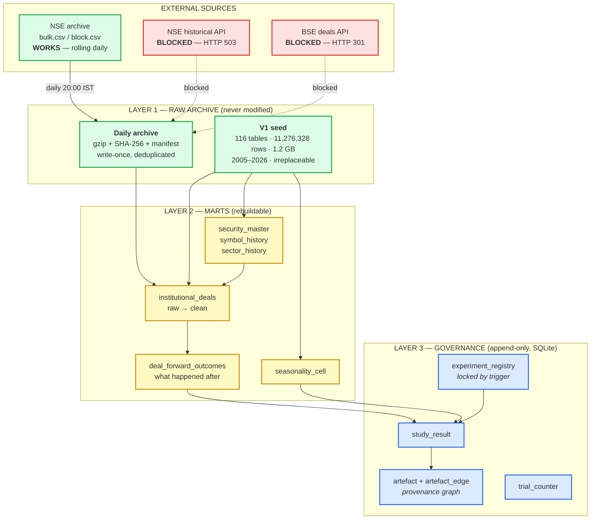
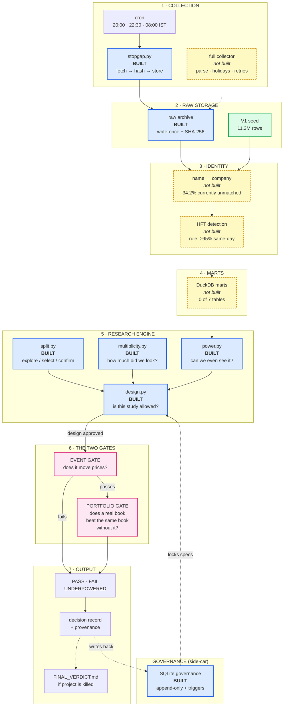
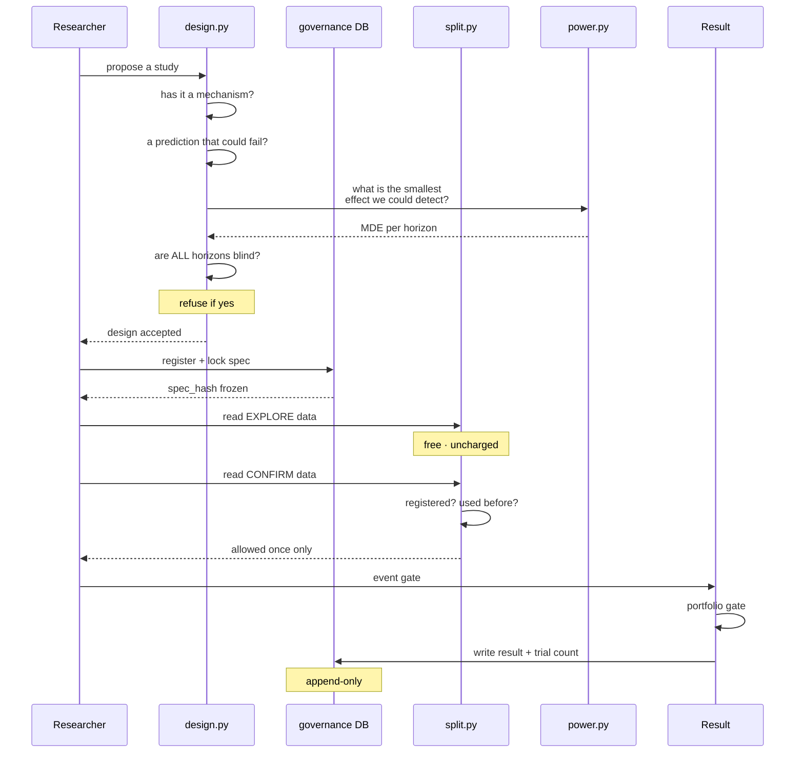

# Institutional Behaviour Research Platform — Project Report

**Author:** Markandeya Varma
**Date:** 18 August 2026
**Repositories:** `MICC` (V1) · `MICCV2` (V2) · `institutional-research` (V3, current)

---

<!--TOC-->

---

## 1. Introduction

This report describes a research system I have been building since June 2026. The
system studies the Indian stock market. Its purpose is to find out whether the
buying and selling done by large institutions — mutual funds, foreign investors,
insurance companies — can tell us anything useful about where share prices go
next.

The project has gone through three versions in about eight weeks. This report
covers all three. It explains what each version did, what it produced, why the
first two were stopped, and what the current version is doing.

I want to say clearly at the start what the honest position is, because the rest
of the report only makes sense with this in view:

> **The system has not found a way to make money. Two versions have been built
> and stopped. The current version is about 15% built. The most likely outcome,
> based on everything measured so far, is that the answer is "there is no usable
> edge here" — and the project is now deliberately designed so that it can say
> that clearly instead of avoiding it.**

That may read like failure. I would argue it is the opposite. The first two
versions could not have told me they were failing, and that is why they ran for
eight weeks. The third version is built so that it can.

### 1.1 What the system actually does

Every day, the two Indian stock exchanges publish a list of large trades. When
somebody buys or sells more than 0.5% of a company's shares in one day, the
exchange must publish it: the date, the company, the name of the buyer or seller,
the quantity, and the price. This is public information. Anybody can download it.

The research question is simple to state:

> When a large institution buys a share, does that share do better than it
> otherwise would have? And if so, is the effect big enough and reliable enough
> to be worth acting on, after costs?

The question is simple. Getting a trustworthy answer is not, and most of this
report is about why.

### 1.2 Reading this report

All numbers in this report were measured from the actual repositories and data on
17–18 August 2026. Nothing is estimated. Where a number is uncertain I say so.
Git commit hashes are given so any claim can be checked.

---

## 2. Why I am building this

### 2.1 The personal reason

I want to learn how to do quantitative financial research properly. Not how to
build a trading bot — that is the easy and useless part — but how to tell the
difference between a real pattern and a coincidence. That distinction turns out
to be the entire subject.

### 2.2 The intellectual reason

Financial markets produce enormous amounts of data, and almost all patterns found
in that data are false. If you test ten thousand ideas against past prices, some
of them will look brilliant purely by chance. This is not a small problem or a
technicality. It is the central problem of the field.

The professional literature has developed real tools for this — pre-registration,
multiple-testing corrections, out-of-sample testing, power analysis. Most amateur
work ignores them completely, finds something that looks wonderful in a backtest,
and loses money. I wanted to build something that uses the real tools.

### 2.3 The specific reason this dataset

Bulk and block deal disclosures are unusually good for this kind of study for
three reasons:

1. **They are events with a date.** You know exactly when the information became
   public, so you can measure what happened afterwards without guessing.
2. **They are free and long.** India has published them since 2006. I have
   223,450 bulk deals and 12,430 block deals going back twenty years.
3. **There is a plausible story.** Large institutions have research departments.
   If anybody has an information advantage, they should. So there is a reason to
   expect an effect, rather than just data-mining and hoping.

Point 3 matters more than it looks. Searching data with no idea of what you are
looking for is how false discoveries are made. Having a reason in advance is what
separates research from fishing.

### 2.4 What I am not building

I want to be exact about this, because it affects the design:

- **No live trading.** No code that places orders exists anywhere in the current
  repository. There is an automated test that fails the build if anybody adds
  functions named `place_order`, `modify_order` or `cancel_order`.
- **No money is at risk.** Nothing is connected to a real trading account.
- **No product.** This is not a startup or a service. It is a research project.

---

## 3. The previous versions, and proof of work

Three versions exist. Two are stopped. All three are in Git, so the history below
can be independently verified.

### 3.1 Version 1 — MICC (28 June – 8 July 2026)

**Repository:** `~/Workspace/MICC`

| Measure | Value |
|---|---|
| Commits | 67 |
| Period | 28 June 2026 → 8 July 2026 (11 days) |
| Files | 191 |
| Python code | 118 files, 23,172 lines |
| Final commit | `e27991f` — *"Portable path layer + SHP backfill completion + verification hardening"* |

First and last commits:

```
2026-06-28  2af2cb1  Initial commit
2026-06-28  ce386d8  Clean data-extraction project: data_extraction/ + data_storage/
2026-06-28  5adf4bd  Fix all extractors: bootstrap, table creation, dead URLs, parquet export
...
2026-07-07  9cf8af0  Frontend: Portfolio page, idea-card lifecycle UI, resilience/a11y/perf + tests
2026-07-08  e27991f  Portable path layer + SHP backfill completion + verification hardening
```

**What V1 was for.** V1 was a data collection project. Its job was to gather
Indian market data from public sources and store it in a usable form. It did that
job, and it did it well.

**What V1 produced.** The lasting output of V1 is a dataset of **116 tables
containing 11,276,328 rows, totalling 1.2 GB**. This still exists, and the
current version is built on it. The largest tables:

| Table | Rows |
|---|---|
| `shp_institutional_summary` | 3,565,899 |
| `shp_promoter_group` | 2,526,543 |
| `window_extremes` | 1,087,140 |
| `shp_category_summary` | 892,410 |
| `pit_universe` | 359,047 |
| `features_monthly` | 343,963 |
| `insider_trading` | 283,281 |
| `bulk_deals` | 223,450 |
| `global_indices_daily` | 212,955 |

**Why V1 stopped.** It did not fail. It was replaced because it had grown into a
mixture of data collection, a web frontend and analysis, all in one codebase,
with no clear separation. Rather than untangle it, I started V2 and carried the
data across. **This was a reasonable decision and the data has proved its value —
it is irreplaceable, because the exchanges do not serve twenty years of history
on request.**

### 3.2 Version 2 — MICCV2 (11 July – 13 August 2026)

**Repository:** `~/Workspace/MICCV2` · **Frozen at tag** `frozen-2026-08-16`

| Measure | Value |
|---|---|
| Commits | 107 |
| Period | 11 July 2026 → 13 August 2026 (34 days) |
| Files | 411 |
| Python code | 204 files, 35,762 lines |
| Tests | 45 files, 375 test functions |
| Reports generated | 136 |

**What V2 was for.** V2 was an attempt to build a complete research and paper
trading system: data warehouse, signal engines, a strategy factory that would
generate and test candidate strategies automatically, a portfolio simulator, and
a dashboard.

**The engineering was good.** This is worth stating plainly. V2 has a real data
warehouse, working data collection, 375 automated tests, and a discipline of
generating verification reports. As a piece of software engineering it is
competent work.

**The research produced nothing.** This is also worth stating plainly.

The strategy factory generated and tested candidate strategies for about five
weeks. The number promoted to live use was **zero**. This is not my
interpretation — the phrase "0 promotions" appears in **18 separate
automatically-generated verdict reports** in the repository.

The final scorecard, from `reports/p7_verdict_2026-08-15.md`:

| Metric | Portfolio | Nifty 500 TR | NIFTY 50 |
|---|---|---|---|
| Sharpe ratio | **1.10** | 0.67 | 0.39 |
| CAGR | 8.1% | 9.2% | 4.6% |
| Volatility | 7.4% | 14.9% | 13.7% |
| Max drawdown | −7.9% | −18.5% | −15.8% |

The system's own pass mark was a Sharpe ratio of 1.3. It scored 1.10. Its own
report calls this **"BELOW FLOOR"**.

Worse, and to the credit of whoever wrote that report, it says so itself:

> *"Of 648 book days, 624 are REPLAY (backtest of the champion) and 24 are inside
> the live-forward window. Of those 24 live-window days, only 9 were CAPTURED
> LIVE."*

So the 1.10 Sharpe is mostly a backtest, and the live evidence is 9 days.

**Why V2 was stopped.** Three reasons, all found during an audit in August 2026.

**Reason 1 — the cost model was wrong.** V2 calculated trading costs incorrectly
in four separate ways: it charged Securities Transaction Tax on one side of a
trade instead of both, used the wrong exchange transaction rate, and applied GST
to the wrong base. Total understatement: **10.04 basis points per round trip.**

This is not a rounding error. V2's best seasonal finding, a "turn of month"
effect, showed **+3.70 basis points** of profit. With the costs corrected it
becomes **−6.36 basis points** — a loss. The system's headline finding was an
artefact of its own accounting mistake.

**Reason 2 — it could not fail.** V2 recorded 22 killed ideas and zero
promotions, over about two years of accumulated development effort, and never
once concluded that the whole approach might not work. There was no rule anywhere
that could stop the project. A system that can only ever say "keep going" is not
performing a test.

**Reason 3 — documentation had drifted from reality.** V2's README described an
automated schedule that no longer matched the actual schedule on the machine.
Nothing checked, so nobody knew.

**The V2 audit is itself part of the work.** Finding these three things took
several days and required reading the whole system. That audit is why V3 exists
and why V3 is designed the way it is.

### 3.3 Version 3 — institutional-research (16 August 2026 – present)

**Repository:** `~/Workspace/institutional-research`

| Measure | Value |
|---|---|
| Commits | 10 |
| Period | 16 August 2026 → present |
| Python code | 3,316 lines |
| Tests | 146, all passing |
| Decision records | 18 |

V3 is deliberately much smaller than V2 and does much less. It is described in
the rest of this report.

### 3.4 Summary of the three versions

| | V1 | V2 | V3 |
|---|---|---|---|
| Duration | 11 days | 34 days | ongoing |
| Commits | 67 | 107 | 10 |
| Lines of Python | 23,172 | 35,762 | 3,316 |
| Tests | — | 375 | 146 |
| Main output | 11.3M rows of data | 136 reports, 0 promotions | discipline framework |
| Status | superseded | frozen | active |
| Honest verdict | **succeeded at its job** | **engineering good, research empty** | **too early to say** |

---

## 4. The complete action plan

The plan for V3 is written in three documents totalling about 100,000 characters
(`docs/plan/PLAN_1_FOUNDATIONS.md`, `PLAN_2_METHODOLOGY.md`,
`PLAN_3_EXECUTION.md`). This section summarises it.

### 4.1 The core idea

The plan is built around one insight from the V2 audit: **the hard part is not
finding patterns, it is not being fooled by them.** So the system is built
discipline-first. The rules that stop self-deception were built before the
research code, not after.

### 4.2 The eight phases

| Phase | What it does | Status |
|---|---|---|
| **0** | Audit V2, freeze it, decide what to carry forward | **done** |
| **0.5** | Test whether data sources actually work | **done** |
| **1** | Foundations: paths, hashing, migrations, discipline framework | **done** |
| **2** | Data collection: daily automated capture of new deals | **partly done** |
| **3** | Identity layer: match company names to companies | not started |
| **4** | Outcomes: calculate what happened after each deal | not started |
| **5** | Benchmarks: compare against similar companies | not started |
| **6** | The four studies | not started |
| **7** | Seasonality rescan | not started |
| **8** | Reporting | not started |

### 4.3 Three tracks

The project runs three research tracks in parallel. They share the discipline
machinery — registration, decision records, correction for how many things were
tried — and almost nothing else, because the statistics of an event, a calendar
pattern and a flow series are genuinely different.

| | **Track D — deals** | **Track S — combinations** | **Track F — FII/DII flows** |
|---|---|---|---|
| Question | do disclosed institutional trades predict returns? | do *any* patterns, found by searching, survive out of sample? | does aggregate foreign and domestic institutional flow predict returns? |
| Data | 223,450 bulk + 12,430 block deals, 2006–2026 | 31.9 million calendar patterns + signal combinations | 15,359 rows of derivatives positioning, 2014–2026 · 68 rows of cash flow |
| Unit | one deal event | one pattern | one trading day |
| Machinery | **built** | **not built** | **not built** |
| Honest state | usable data, one study rejected | already scanned once, found nothing | **almost no cash data — see below** |

### 4.3.1 Track D — the four deal studies

The deal track comes down to four questions.

**Study 1 — Do institutional buys predict anything?**
When an institution buys, does the share beat comparable shares over the next
1, 2, 3, 5, 10 or 21 trading days?

**Study 2 — Do institutional sells predict anything?**
The same question for selling. There is a reason to think selling is more
informative: institutions buy for many reasons (money coming in, index tracking,
rebalancing) but sell for fewer. 34,270 sell events have never been examined.

**Study 3 — Does agreement between institutions mean more?**
When three or more different institutions buy the same share within 21 days, is
that stronger than one institution buying? 10,098 such events exist.

### 4.3.2 Track S — the search track, and the 31.9 million combinations

This is half the project, and it is the half where it is easiest to fool
yourself.

**What the 31.9 million are.** A "calendar pattern" is a question of the form:
*does this share tend to rise during a particular stretch of the year?* Each one
is a combination of a window length, a starting point in the calendar, and a
company:

```
13 window lengths  ×  242 starting points  ×  4,200 companies  =  13.2 million
plus index-level variants, four calendar alignments, two ways of measuring
                                                    =  31,893,556
```

**V2 already scanned all of them, and found nothing.** Its own conclusion:

> *"Essentially none of it survives contact with its own null. The single best
> pattern found — a 3-day window that rose in 94.7% of years — sits at the 94th
> percentile of what randomly rotated data produces, which is to say it is an
> ordinary result of looking 31.9 million times."*

And the part that matters most: **the scan of millions found nothing, while eight
carefully-reasoned guesses found two.** Both of those two were then killed by the
corrected cost model.

**So why do it again?** Because V2 only ever asked *"is this better than chance in
the data I have?"* It never asked *"does it happen again?"* — which is the only
question a pattern claim actually makes. Track S asks the second one: find a
pattern in 2005–2015, then require it to repeat in 2016 onward, which it has
never seen.

#### What measuring it honestly revealed

Three findings, each of which changed the design before any code was written.

**A calendar pattern happens once a year.** So a company with 21 years of history
gives 21 observations for any one pattern — total, ever. Split into training and
testing, that leaves two to five. With two observations you could only detect an
effect of about **50% a year**. Per-company calendar analysis is not difficult;
it is arithmetically impossible. And the history is not there either: the median
company has **5.5 years** of prices, and only 513 of 4,200 have twenty.

**Combining companies does not rescue it.** The obvious fix is to pool all 4,200
together. But every company experiences a given calendar day *simultaneously*, so
they all share whatever the market did that day. Measured on real data, the
average pairwise correlation of daily returns is **+0.235**, which reduces 21,000
apparent observations to about **four** genuinely independent ones.

**And the obvious repair turned out to be empty.** Subtracting the market's own
movement removes the shared part — but if "the market" is defined as the average
of those same companies, then the average of what is left is **exactly zero, on
every single day**. I had designed a measurement incapable of producing a number,
and only found it by checking.

#### What survived

One approach. Instead of asking *"is this stretch of the calendar good?"*, ask
**"does it rank companies consistently, and does that ranking hold up in years it
has never seen?"** A persistent *ordering* is far harder to produce by luck than
a persistent average — chance does not put four thousand things in the same order
twice.

Measured, this can detect a signal strength of about **0.014**, against typical
real-world values of 0.02 to 0.05. It is the only formulation in this project
that can see something real, and that single fact is why the search track is
worth building at all.

#### The second half: combinations of trading signals

Calendar patterns are only one of the two things being searched. The other is
**combinations of trading signals** — and these have much better arithmetic,
because a signal can fire dozens of times a year per company rather than once.

A "signal" is a simple observable fact about a share on a given day. Seven
families are in scope, and **each one has to have a reason stated before it is
allowed in**:

| Family | Roughly | Why it might work |
|---|---:|---|
| Momentum | 40 variants | prices react to news slowly, so recent movement continues |
| Reversal | 30 | whoever supplies liquidity in a panic gets paid for it |
| Volatility | 25 | calmer shares have historically returned more than their risk suggests |
| Volume | 25 | unusual activity marks unusual attention |
| Liquidity | 20 | harder-to-trade shares must offer more to compensate |
| Seasonal | 30 | money genuinely does arrive on a calendar — salaries, index changes |
| Institutional | 20 | Track D's deal signals, reused as inputs here |

These get combined up to three deep, with thresholds — *"momentum in the top
fifth, AND volume more than twice normal, AND an institution bought last week"* —
which produces hundreds of thousands of candidates.

**Requiring a reason for each ingredient is not a formality.** The search is
deliberately wide, but width is not a licence to include things nobody can
explain. A combination that works and cannot be explained is far more likely to
be a coincidence than a discovery.

#### How the testing actually works

This is the part that separates it from V2's approach. Each candidate is judged
by repeated rounds of **train on the past, test on what comes next**:

```
round 1:  learn from 2005–2010    then test on 2010–2012
round 2:  learn from 2005–2011    then test on 2011–2013
round 3:  learn from 2005–2012    then test on 2012–2014
              ... and so on, sixteen rounds
```

The training window always starts in 2005 and stretches further each time, which
mimics how the method would actually have been used: at any point you know
everything up to today and nothing after it.

**But sixteen rounds are not sixteen pieces of evidence.** Because each training
window contains almost all of the previous one, consecutive rounds are roughly
95% the same calculation. Counted honestly, sixteen rounds carry about **eight**
genuinely independent tests. A second scheme that shuffles which stretches of
time are used for testing produces about 120 rounds worth roughly 20.

**Every result will report both numbers** — the rounds run and the independent
tests they actually represent. Quoting the first without the second is one of the
easiest ways to make thin evidence look thick, and it is exactly the sort of
thing this project exists to avoid.

#### The deliverable is not a list of patterns

Picking the best of 31.9 million is hopeless — the best of that many coin flips
looks impressive too. So the headline result is deliberately a different thing:

> **Across many training-and-testing rounds, how often does a pattern chosen in
> training actually win in testing?**

If the answer is about half the time, then searching does not work on this data —
a real and useful finding that goes well beyond this project. If it is
meaningfully better than half, that is a durable discovery about *method*, which
is worth far more than any single pattern.

This reframing is what makes searching 31.9 million things defensible rather than
reckless: **the size of the search stops being a liability and becomes the
measuring instrument.** The wider you search, the more precisely you measure how
badly searching overfits.

**Honest expectation, stated in advance:** most likely the answer is "about half
the time", and almost nothing survives. That is the outcome I expect and it is
still worth having.

### 4.3.3 Track F — FII/DII flows, and why it is barely a track yet

Every day the exchange publishes how much foreign institutional investors and
domestic institutional investors bought and sold in total. It is the most-watched
number in Indian financial media, and the obvious question is whether it predicts
anything.

**The honest state of this track is that I have almost no data.**

| Source | Rows | Period | What it actually is |
|---|---:|---|---|
| Cash-market flow | **68** | 17 Jun – 8 Jul 2026 | the real thing — **22 days** |
| Derivatives positioning | 15,359 | 2014 – 2026 | **a different measure** (see below) |

**Twenty-two days is not a dataset**, and this is the one gap that cannot be
solved by working harder. The exchange publishes today's figure and does not
serve history, so the only way to obtain it is to collect it going forward, one
day at a time. Roughly two years of collection are needed before any study is
possible — which is past this project's own deadline. **The daily collector runs
for exactly this reason: every day not captured is lost permanently.**

**The twelve-year series is not the same measure, and saying so matters.** It
records how institutions were positioned in *futures and options*, not how much
stock they bought. Those two things can move in opposite directions — an
institution can buy shares while hedging with futures. Treating one as a proxy
for the other is the sort of quiet substitution that produces a confident wrong
answer, so every study using it will state plainly that it measures derivatives
positioning.

**What this track can honestly do now:** ask whether *derivatives positioning*
predicts returns, using twelve years of real data, clearly labelled as a
different question from the cash-flow one. That study is possible today.

**What it cannot do:** answer the question people actually mean by "FII/DII
flows" — not before roughly 2028.

This is the clearest example in the project of a limit set by data rather than by
effort or method, and it is stated here rather than discovered later.

---

### 4.4 The rules every study must follow

These are the heart of the plan.

**Rule 1 — Write down the answer you will accept, before you look.**
Before a study runs, its hypothesis, method, and pass mark are written to a
database and locked. A database trigger physically refuses to let them be
changed afterwards. This is verified by trying to change one and being blocked.

**Rule 2 — Exploring must be free.**
The data is split into three parts: 30% for free exploration, 20% for choosing
between candidates, 50% for final confirmation. You may look at the exploration
part as much as you like at no cost. The confirmation part may be used once per
registered study, enforced by code that raises an error.

**Rule 3 — Count everything you looked at.**
If you test 171 ideas, the best one will look good by luck alone. The system
calculates how good: with 171 attempts, pure noise produces a best result of
about t = 2.94, so the bar is set at t = 3.71. With 31.9 million attempts the bar
rises past t = 7, and for patterns measured on few observations it rises further
still. These figures were themselves corrected on 18 August — see §7.6.

**Rule 4 — Check the same list of confusions every time.**
Ten standard alternative explanations are checked automatically for every study.
Any that do not apply must be dismissed in writing.

**Rule 5 — An event study is not a strategy test.**
A finding must pass two separate gates: does the event move prices, *and* does an
actual portfolio built on it beat the same portfolio without it, after costs.
Section 7.3 explains why this rule exists.

**Rule 6 — The project can be abandoned.**
If three of the four studies fail, or if nothing has passed by 28 February 2027,
the conclusion is written up as a negative result and the project stops.

---

## 5. The data warehouse

### 5.1 Design principles

**Raw data is never changed or deleted.** Files are downloaded, hashed, stored
compressed, and never touched again. If a file is understood wrongly, it can be
re-read later. V2 stored nothing raw and had 1.2 GB of data it could not re-derive.

**Every day not collected is lost forever.** The exchange publishes today's deals
at one web address, and replaces it tomorrow. The historical service returns an
error. So collection is time-critical: about 27 trading days are already
permanently missing.

**Derived data can always be rebuilt.** Anything computed from raw data can be
deleted and regenerated. Only the raw layer is precious.

### 5.2 The layers



**Legend.** Green = working. Red = blocked. Blue = built. Yellow = designed but
not yet built.

### 5.3 Honest status of the warehouse

| Layer | Designed | Built | Note |
|---|---|---|---|
| Raw archive | yes | **yes** | 3 files captured so far; 16 KB |
| V1 seed carried across | yes | **no** | still sits in the V2 folder, not copied |
| Marts | yes | **no** | 0 of 7 tables exist as real schemas |
| Governance | yes | **yes** | 9 tables, live and enforcing |

**The marts are the gap.** Seven tables are described in the plan in detail, with
column lists and constraints, but none of them has been created. They exist as
prose in a document, not as a database.

### 5.4 Two data problems found by measurement

These were found on 17 August 2026 by running real queries. Both are serious and
neither was in the plan.

**Problem 1 — one third of deals cannot be matched to a price.**

Of 25,097 institutional buy events, only 16,517 could be linked to price data:

| Reason | Events | Share |
|---|---|---|
| Company not in the price database at all | 5,080 | 20.2% |
| Deal happened before price coverage begins | 1,808 | 7.2% |
| Deal happened after price coverage ends | 83 | 0.3% |
| Price data exists but not for that exact day | 1,609 | 6.4% |
| **Successfully matched** | **16,517** | **65.8%** |

The plan sets a 5% limit for unmatched records. The reality is 34.2% — seven
times over. Every result computed so far uses only the surviving two thirds.

**Problem 2 — there is no historical industry classification.**

The plan's main method for fair comparison requires knowing what industry a
company was in at the time of the deal. The only industry data available covers
**1,415 companies out of 4,200 (33.7%)**, and it is a single snapshot taken
between 30 June and 2 July 2026. Applying 2026 industry labels to a 2005 event
means using information that did not exist yet — the exact error the whole
project is designed to avoid.

**This is currently an unsolved problem, not a task.** I do not have a source for
it.

---

## 6. The system architecture

### 6.1 Overview



### 6.2 How a study flows through the system



### 6.3 Why the architecture looks like this

Each part exists because of a specific V2 failure.

| Component | The V2 failure it prevents |
|---|---|
| Explicit environment (`paths.py`) | V2's checker defaulted to "dev", failed there, and rebuilt the *production* warehouse while reporting on dev |
| Read-only snapshots | V2 served its dashboard from the live database; 7 of 12 pages returned errors whenever anything was writing |
| Write-once raw archive | V2's raw folders were all zero bytes — data went straight into the warehouse and could not be re-derived |
| Locked experiment specs | V2 could not tell a prediction from an explanation made afterwards |
| Trial counter that sets bars | V2 counted attempts and never used the count for anything |
| Two gates | V2 had no portfolio test at all, so a finding could pass on event evidence alone |
| Documentation drift test | V2's README described a schedule that had changed |
| Provenance graph | V2 could not answer "which numbers came from this data?" |

---

## 7. What is completed

### 7.1 The discipline framework — complete and working

This is the substantial achievement so far. 146 automated tests, all passing.

**Power analysis (`power.py`, 311 lines).** Answers "could this study have seen
the effect even if it were there?" before running. If the answer is no, the
verdict is UNDERPOWERED — reported as *silence*, not as evidence of absence.
This distinction did not exist in V2.

**Data split (`split.py`, 237 lines).** Divides companies into three groups by a
mathematical hash of their ISIN code. Exploration is free; confirmation is
enforced by code that raises an error.

The choice of ISIN rather than company symbol was driven by measurement:

| Finding | Value |
|---|---|
| ISINs with more than one symbol over time | 276 |
| Those symbols appearing in deal data | 459 |
| Deal records affected | 26,046 (**11.04%**) |

Real examples: `CADILAHC` became `ZYDUSLIFE`; `PRISMCEM` became `PRSMJOHNSN`. If
the split used symbols, those companies would sit in the exploration group under
one name and the confirmation group under the other — contaminating the
confirmation set for 11% of the data, with nothing looking wrong in any output.

**Multiple testing (`multiplicity.py`, 186 lines).** Converts "how many things did
we try" into a required standard of evidence:

| Attempts | Best result from pure noise | Required standard |
|---|---|---|
| 10 | t = 1.90 | t = 2.80 |
| 171 | t = 2.94 | **t = 3.71** |
| 1,000 | t = 3.45 | t = 4.31 |
| 31,893,556 | t = 5.63 | **t = 7.04** |

*(Corrected 18 August. The figures first published were lower — see §7.6.)*

**Design gate (`design.py`, 275 lines).** Refuses to let a study exist unless it
has a mechanism, a prediction that could fail, computed detectability, and a plan
for all ten standard confusions.

The test that proves this is worth having is that **it rejects the project's own
first experiment.** More on that in 7.3.

### 7.2 Documentation that cannot silently rot

Twenty-six decision records, each recording what was decided, by whom, why, **what
would reverse it**, and what it costs. An automated test fails the build if any
record is missing those fields.

A second test compares the plan documents against the configuration files. On its
first run it found three real errors: the plan still advertised abandoned time
horizons, never mentioned the portfolio gate, and never mentioned the data split.
All three were fixed.

### 7.3 A completed experiment, and why it matters

One full experiment has been run start to finish: `exp_001`.

**The hypothesis.** A portfolio of the largest 500 Indian companies which
*avoids* any company that had an institutional buy in the last 10 trading days
will do better than the same portfolio without that rule.

**The sequence, which is the point.** The prediction and the pass mark were
written to the database and locked in commit `f25608d`. The test was run
afterwards. The result was recorded in commit `c31e128`. **The registration is
earlier in the Git history than the result**, so it cannot have been written to
fit the answer.

**What happened at the event level.** The effect was real and survived three
attempts to kill it:

| Check | Result |
|---|---|
| vs random companies, same dates | −0.860% specific to the event |
| vs companies of similar volatility | **−0.805%, t = −3.93** |
| Is it just price reversal? | No — correlation +0.008, pattern not monotonic |

**What happened at the portfolio level.**

| Half of the data | Annual difference | t | Verdict |
|---|---|---|---|
| First half | +0.237% | +3.11 | FAIL |
| Held-back half | **−0.022%** | **−0.25** | FAIL |

**Why it died.** The rule only excluded **1.2% of companies** at any time. A
−0.8% effect applied to 1.2% of a portfolio is about one basis point a month —
nothing.

**This is the most valuable thing learned so far.** Every statistic in the event
study was correct and pointed the same way. The study was still useless. Only
building the actual portfolio revealed it. **An event study is not a strategy
test**, and the gap between them is not a technicality.

Under V2's design this would have been recorded as a success.

### 7.4 A measurement that corrected me

On 17 August I stated that all the project's detectability calculations were too
optimistic because they treated companies as independent. **This was wrong**, and
I found it wrong within hours by measuring it:

| Method | Detectable effect |
|---|---|
| Treating 16,445 events as independent | 0.076% ← never actually done |
| What the code actually does (monthly grouping) | 0.621% |
| With the correction that *was* missing | **0.660%** |

The eight-fold penalty was already being applied. The real gap was a different
and smaller one — correlation between months, worth 6–27%, not a factor of three.

This is recorded in decision record 0017 rather than quietly edited out. I include
it here because a report that only lists successes is not a report.

### 7.5 Daily data capture — running

A collector runs automatically at 20:00, 22:30 and 08:00 IST. On its first night
it captured 100 bulk deals and 4 block deals, verified by hash. Files are
compressed, hashed, never overwritten, and duplicates are detected.

### 7.6 Four errors of my own, found by verification

On 18 August I was asked simply *"are you sure about the whole thing?"* Checking
found four errors in work committed within the previous day. I record them
because a report listing only successes is not a report, and because how they
were found matters more than that they existed.

**Error 1 — a statistic that measured itself.** I reported that removing the
market's overall movement from returns made stocks statistically independent, and
built a design on it. In fact the calculation I used *forces* that answer no
matter what the data contains. Feeding it a strongly-linked dataset and a
completely random one produced the same result. It measured the arithmetic of the
operation, not the market.

**Error 2 — a question with no possible answer.** Worse, the way I had defined
"market-relative" meant that the quantity I proposed to study is exactly zero for
every day by construction. I had designed a measurement incapable of producing a
number. The correct approach — comparing *rankings* of stocks rather than their
average — was in the plan as one option among several. It is in fact the only
one.

**Errors 3 and 4 — the significance bar was too low, twice.** The tool that sets
how strong evidence must be had two independent faults, and both made results
*easier* to pass:

| Fault | Effect |
|---|---|
| Measured one direction of movement while being applied to both | every bar understated |
| Assumed a bell curve where the true distribution has heavier tails | a further 23% understatement for small samples |

Corrected, the bar for the deal track rises from t = 3.62 to **t = 3.71**. The
one completed experiment still clears it, so **no recorded verdict changes.**

**Why they survived 146 tests.** The tests compared the tool against *its own
output*, pinned as expected values. A test asserting that code agrees with itself
proves nothing. The replacement tests compare against independent simulation,
which is the standard the originals should have met.

**What this says about the project.** The framework caught none of these — a
person asking a direct question did. The safeguards are real and they are not
sufficient, and I would rather state that than present a system that appears to
police itself.

---

## 8. What is going on now

### 8.1 Measuring whether there is anything to find

The current activity is establishing what size of effect this data can possibly
reveal. Results from 17 August, on 16,445 real institutional buy events:

| Horizon | Observed effect | Smallest detectable | Conclusion |
|---|---|---|---|
| 1 session | **+0.691%** | 0.191% | detectable |
| 5 sessions | −0.010% | 0.423% | nothing |
| 10 sessions | −0.603% | 0.660% | **below the floor** |
| 21 sessions | **−1.061%** | 0.968% | detectable but implausibly large |

**Two things stand out.**

**The sign flips.** Shares rise 0.691% on the first day, then fall, ending
1.061% down after 21 days. This is the classic signature of a temporary price
push that then reverses — consistent with the finding that **54.8% of bulk deals
are the same party buying and selling on the same day**, which is market-making
activity, not investment.

**The earlier finding weakens.** The 10-session effect of −0.603% is *smaller*
than the 0.660% we can reliably detect. The −0.805% found in `exp_001` came from
comparing against companies of similar volatility, and it was that tighter
comparison that provided the sensitivity — not the effect being robust to any
comparison.

### 8.2 An unresolved question that affects everything

The system judges whether a study is worth running by comparing what it can
detect against what size of effect is realistic. That threshold is currently a
single number — 0.5% per month.

**The problem:** this number is compared against every time horizon, but it is
only dimensionally correct at about 21 sessions. Comparing a one-day result
against a monthly threshold is a units error.

The fix depends on an unanswered question about how the effect should behave:

- **If a disclosure causes a single one-off price adjustment**, a fixed threshold
  is right and the table above stands.
- **If institutions have persistent skill that accrues over time**, the threshold
  must scale with the horizon — and then **every row in the table becomes
  undetectable**, including the two marked otherwise.

This is recorded as open decision 0018. **Until it is resolved, no result in this
project should be quoted as final.** It is the single most important open item.

---

## 9. What is pending

### 9.1 Build status, measured

| Component | Status |
|---|---|
| Environment, paths, hashing, migrations | **built** |
| Discipline framework | **built** |
| Daily capture (basic) | **built** |
| Trading calendar | not built |
| V1 data copied into the project | **not done** |
| Reconciliation check | **never run** |
| Full collector | not built |
| Company identity matching | not built |
| Institution name normalisation | not built |
| Outcome calculation | not built |
| Cost model in code | config only |
| Benchmark construction | config only |
| The four deal studies (Track D) | not built |
| **Track S — walk-forward folds** | **not built** |
| **Track S — calendar scan** | **not built** |
| **Track S — signal combinations** | **not built** |
| **Track S — the procedure test** | **not built** |
| Provenance graph populated | **0 rows** |

**Seven of seven core data tables do not exist, and all seven Track S modules
are unwritten.** The project folder currently
holds 16 KB of data.

**About 15% of the system is built**, and the completed portion is the framework
rather than the research machinery.

### 9.2 Three things in the plan that cannot be built as written

**1. No historical industry data (Section 5.4).** The plan's main comparison
method needs it. It covers 33.7% of companies and is a single 2026 snapshot.
There is no known source. **This is a genuine blocker, not a task.**

**2. Company matching is unspecified.** The plan sets a 5% limit and gives no
method for reaching it. Measured reality is 34.2%.

**3. The seasonality rescan has no time estimate.** "About three weeks" is an
assertion; no single unit of the calculation has ever been timed, and a later
decision roughly quadrupled the work.

### 9.3 Risks

| Risk | Status |
|---|---|
| **No backup of any kind** | **open** — no remote repository, no external drive. Captured trading days cannot be re-obtained at any price |
| Data lost each uncollected day | reduced — collector now runs, but ~27 days already lost |
| BSE data unavailable | open — all routes return errors |
| Historical backfill impossible | open — service returns error 503 |
| No detectable effect exists | **the most likely outcome** |

### 9.4 Timeline, and why it had to be rewritten

The plan originally listed nine phases in sequence and stated that no deadline
had been set. **That was false** — a deadline of 28 February 2027 had been fixed
two days earlier. Measured honestly, at the 2–3 hours a day I actually have:

| | Weeks |
|---|---:|
| calendar available | 27.9 |
| work planned | 26.2 |
| **slack** | **+1.7** |

Six percent. On a project where **every estimate so far has been wrong**, a 25%
overrun — which is optimistic for software — missed the deadline by five weeks.

The fix is not a better estimate. It is deciding **in advance** what gets cut.

#### The critical path — 14 weeks to one defensible answer

| Phase | Weeks | Ends |
|---|---:|---|
| Warehouse and reconciliation | 3 | 7 Sep 2026 |
| Collection *(reduced — the daily capture already runs)* | 1 | 14 Sep 2026 |
| Identity layer *(where the 34.2% matching failure lives)* | 4 | 12 Oct 2026 |
| Clean data mart | 2 | 26 Oct 2026 |
| Costs and benchmarks | 2 | 9 Nov 2026 |
| **One** outcome study | 2 | **23 Nov 2026** |

This lands one week inside the checkpoint, with **13.9 weeks of buffer** — 36%
overrun tolerance in place of 6%.

Two reductions make it fit, and neither is guesswork. Collection drops from three
weeks to one because the daily capture has been running since 17 August and the
raw bytes are already safe; the full parser can wait for a study that needs it.
The outcome study drops from four studies to **one**, because one study answered
is worth more than four half-answered.

#### What gets cut, decided now

| Extension | Weeks | Cut order |
|---|---:|---|
| Re-run the first experiment reproducibly | 0.2 | last |
| Studies 2–4 | 3 | |
| The search track | 4 | |
| Seasonality | 1 | |
| Monitoring and automated reports | 2 | **first** |

Under deadline pressure, what gets dropped is whatever is least *defended* at
that moment — not whatever matters least. Deciding the order now, while nothing
is at stake, is the only point at which that decision is honest.

**The seasonality decision changed as part of this.** I had chosen to rebuild all
31.9 million calendar cells from scratch — three weeks — against advice to
validate the existing ones instead. Faced with the schedule arithmetic I reversed
that: validation takes one week, and those two weeks are what the buffer is made
of. Validation is not "trust the old numbers": a 100,000-cell sample is
recomputed from scratch and must match **exactly**, any mismatch escalates
automatically back to a full rebuild, and every statistical conclusion is
recomputed regardless. What is reused is the raw cell counts, which are cheap to
check and expensive to regenerate.

**Honest limit.** This makes the deadline survivable for the thing that matters —
one answer by the checkpoint — but not for everything. Running the full extension
list still misses a 25% overrun by 2.4 weeks. That is what the cut order is for.

| Date | Milestone |
|---|---|
| 23 November 2026 | Critical path complete — first portfolio-gated verdict |
| 30 November 2026 | Checkpoint — if no study has reached even the first gate, stop early |
| 28 February 2027 | Deadline — if nothing has passed, write the negative result and stop |

---

## 10. What this is currently used for

I want to be accurate here rather than flattering.

### 10.1 What it is used for today

**Nothing financial.** No money is invested. No orders are placed. No
recommendations are produced.

The system currently has three real uses:

1. **Daily data capture.** It is preserving Indian institutional deal data that
   would otherwise be permanently lost. This has value regardless of whether the
   research succeeds.
2. **A method for testing ideas honestly.** The framework — pre-registration,
   split data, multiple-testing correction, two gates — is general. It applies to
   any field where you search data for patterns.
3. **Learning.** I now understand why most quantitative research fails, because
   I have made the mistakes and measured them.

### 10.2 What it is not used for

- Not trading, and not connected to any account
- Not advising anyone
- Not producing predictions
- Not producing any validated finding — **zero results have passed both gates**

### 10.3 What it could be used for if it works

If a study passes both gates and survives the deadline, the output would be a
documented, reproducible finding about Indian institutional behaviour, with its
provenance recorded. Whether that would be worth trading is a separate question
requiring capital, execution and risk management that do not exist here.

**Based on the evidence so far I would put the probability of a tradable finding
below 20%.** The signals point the wrong way: the effect reverses across
horizons, most bulk-deal activity is market-making rather than investment, the
one completed experiment failed, and the detectability question in Section 8.2
may render the whole range unusable.

### 10.4 The most likely honest outcome

The most likely result is a well-documented negative: *public institutional deal
disclosure in India does not contain a tradable edge for a retail participant
after realistic costs.*

That is a legitimate result. It is also unpublishable in most amateur settings,
which is precisely why so much amateur work reports positives.

---

## 11. Conclusion

### 11.1 What has been achieved

In roughly eight weeks I have built three versions of a market research system,
audited two of them to destruction, and produced:

- A dataset of 11.3 million rows spanning 2005–2026, still in use
- A working data warehouse and collection system (V2), now frozen
- A discipline framework with 239 tests that enforces honest research
- One complete experiment, correctly rejected by its own pre-registered rule
- Twenty-six decision records with reversal conditions
- Four material measurements that changed the plan: a 10.04 bp cost error, 54.8%
  market-making contamination, a 34.2% matching failure, and a missing industry
  history

### 11.2 What has not been achieved

- **No validated finding.** Zero results have passed both gates.
- **No profitable strategy.** V2 promoted zero strategies in five weeks.
- **The V3 system is ~15% built.** No core data table exists.
- **Two plan components have no data source.**
- **One critical question is unresolved** and may invalidate every current result.

### 11.3 The honest assessment

If this project is judged on "did you find a way to beat the market", the answer
is no, and probably will remain no.

If it is judged on "did you build something that can tell the difference between a
real finding and a lucky one", the answer is yes, and that is the harder problem.

The difference between V2 and V3 is not sophistication — V2 has ten times the
code. It is that V2 could not fail and V3 can. V2 ran for five weeks producing
zero promotions and never concluded anything was wrong. V3 has a written rule
that stops the project on 28 February 2027 if nothing works, and a first
experiment that was killed by its own pre-registered standard within ninety
minutes of looking promising.

### 11.4 What I have learned

**Most patterns in financial data are false.** With 171 attempts, noise alone
produces a t-statistic of 2.94 — which most people would report as highly
significant.

**Being able to fail is a feature.** V2's real defect was not any single bug. It
was that no possible result would have caused it to stop.

**Statistics that are individually correct can be collectively useless.**
`exp_001`'s event study was correct in every particular and the strategy was
worthless, because the rule touched 1.2% of the portfolio.

**Measurement beats assumption, including about yourself.** Four significant
errors were found by measuring rather than reasoning — including one of my own,
made and corrected within hours on 17 August.

### 11.5 Next steps

These are the critical path of §9.4, in order. Everything else is an extension
that gets cut before this list does.

1. **Answer the detectability question** — one judgement, and it gates everything
   downstream. The code now *refuses* to register the affected studies rather
   than guessing, so this is a hard block rather than a nagging one.
2. **Arrange a backup.** A single disk failure currently loses irreplaceable
   data, including trading days that cannot be re-obtained at any price. Cheap,
   and it is the only item here whose cost of neglect is permanent.
3. **Copy the data in and run the reconciliation check.** Nothing downstream can
   be trusted until it passes, and it is also the cheapest way to find out
   whether the 34.2% matching failure is fixable or structural.
4. **Establish whether the industry-history problem is solvable.** If it is not,
   the primary comparison method has to change, and I would rather know that in
   September than in January.
5. **Then run one study, properly** — institutional selling, 34,270 events, never
   examined. One study through both gates by 23 November is the deliverable.
   Studies 2 to 4 are extensions.

---
